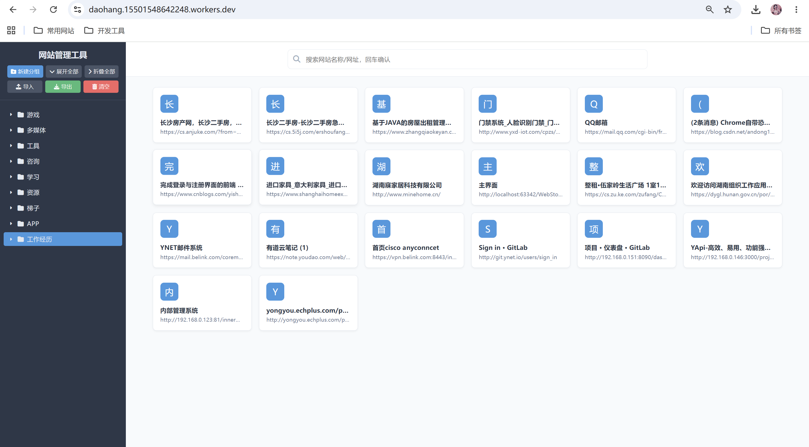

# 云导航项目需求文档 (PRD)

## 1. 项目概述

### 1.1 项目背景
基于现有的**云导航静态网页项目**进行优化升级，将其改造为**前后端分离**的现代化 Web 应用，以便更好地支持用户个性化配置、数据持久化和多端访问。

### 1.2 项目目标
- 实现用户注册/登录体系，支持多用户独立的导航配置
- 将导航数据持久化到后端数据库，防止浏览器缓存丢失
- 提升用户体验，实现实时保存和友好的状态提示

### 1.3 原始项目
- **原始网站地址**：https://daohang.15501548642248.workers.dev/
- **原始项目类型**：纯静态 HTML + CSS + JavaScript

### 1.4 术语表
| 术语 | 说明 |
|------|------|
| 导航标签 | 用户自定义的网站快捷入口，包含名称、URL、图标等 |
| 脏数据 | 用户修改后未保存的数据 |

---

## 2. 技术架构

### 2.1 技术栈

| 层级 | 技术选型 | 版本 | 说明 |
|------|----------|------|------|
| 前端框架 | HTML5 + CSS3 + JavaScript | - | 保持原有技术栈，无框架依赖 |
| 前端UI | 原生 DOM 操作 | - | 轻量级，无需构建工具 |
| 后端框架 | Spring Boot | 2.7.x | 兼容当前 Java 8 运行环境 |
| 权限认证 | Apache Shiro | 1.13+ | 轻量级安全框架 |
| ORM框架 | MyBatis-Plus | 3.5+ | 简化数据库操作 |
| 数据库 | MySQL | 8.0+ | 主流关系型数据库 |
| Java 运行时 | JDK | 1.8 | 当前阶段兼容 Java 1.8.0_241；后续可升级 JDK 17+ |
| 前端构建 | 无（可选 Vite） | - | 当前阶段不引入构建工具；后续可评估 Vue 3 + Vite |

### 2.2 架构图（文字描述）

```
┌─────────────┐     ┌─────────────┐     ┌─────────────┐
│   浏览器    │────▶│  Spring Boot│────▶│    MySQL    │
│  (前端页面) │◀────│  REST API   │◀────│   数据库    │
└─────────────┘     └─────────────┘     └─────────────┘
                           │
                    ┌──────┴──────┐
                    │  Shiro 认证  │
                    └─────────────┘
```

---

## 3. 功能需求

### 3.1 用户角色与权限矩阵

| 功能 | 未登录用户 | 已登录用户 |
|------|:----------:|:----------:|
| 查看登录按钮 | ✅ | ❌ |
| 查看导航标签 | ❌ | ✅ |
| 新增导航标签 | ❌ | ✅ |
| 修改导航标签 | ❌ | ✅ |
| 删除导航标签 | ❌ | ✅ |
| 手动保存 (Ctrl+S) | ❌ | ✅ |
| 自动保存 | ❌ | ✅ |
| 退出登录 | ❌ | ✅ |

---

### 3.2 功能详细说明

#### F-01 用户注册

- **描述**：新用户通过注册页面创建账户
- **验收标准**：
  1. 点击登录弹窗中的「注册」Tab 切换到注册表单
  2. 输入用户名和密码（密码需两次确认）
  3. 用户名唯一校验（重复则提示「用户名已存在」）
  4. 注册成功后自动登录并跳转回导航首页
- **约束**：
  - 暂不支持邮箱绑定
  - 用户名长度：3-20 字符
  - 密码长度：6-20 字符

#### F-02 用户登录

- **描述**：已注册用户通过账号密码登录系统
- **验收标准**：
  1. 点击「登录」按钮弹出登录窗口
  2. 窗口顶部分「登录」和「注册」两个 Tab
  3. 输入正确的用户名和密码后登录成功
  4. 登录失败显示错误提示（「用户名或密码错误」）
  5. 登录成功后自动加载该用户的导航标签数据
  6. 页面底部显示「退出登录」按钮
- **安全要求**：
  - 使用 Shiro 进行身份认证
  - 密码需加密存储（推荐 BCrypt）
  - 登录成功后建立 Session

#### F-03 默认页面（未登录状态）

- **描述**：未登录用户访问首页时的展示
- **验收标准**：
  1. 不加载任何导航标签
  2. 不显示任何操作按钮
  3. 在「网站管理工具」标题下方显示「登录」按钮
  4. 点击「登录」按钮弹出登录窗口

#### F-04 导航标签管理（已登录状态）

- **描述**：用户登录后对导航标签的增删改查操作
- **验收标准**：
  1. 登录成功后自动加载并展示用户的所有导航标签
  2. 「网站管理工具」标题下方显示操作按钮（新增、编辑、删除等）
  3. 点击「新增」按钮弹出标签编辑表单
  4. 编辑现有标签时表单预填当前数据
  5. 删除标签前需二次确认

#### F-05 数据保存机制

- **描述**：确保用户操作的数据及时保存到服务器
- **验收标准**：
  1. **手动保存**：支持 `Ctrl + S` 快捷键，将当前所有导航数据以 JSON 格式提交到服务器
  2. **自动保存**：每次对导航标签进行新增/修改/删除操作后，系统检测数据变化
  3. **脏数据提示**：当检测到数据与服务器不一致时，保存按钮变为**醒目绿色**
  4. **状态反馈**：保存成功后保存按钮恢复为灰色（表示无待保存更改）
  5. **保存失败**：显示错误提示，并保持绿色等待重试

#### F-05 数据保存机制

- **描述**：确保用户操作的数据及时保存到服务器
- **验收标准**：
  1. **手动保存**：支持 `Ctrl + S` 快捷键，将当前所有导航数据以 JSON 格式提交到服务器
  2. **自动保存**：每次对导航标签进行新增/修改/删除操作后，系统检测数据变化
  3. **脏数据提示**：当检测到数据与服务器不一致时，保存按钮变为**醒目绿色**
  4. **状态反馈**：保存成功后保存按钮恢复为灰色（表示无待保存更改）
  5. **保存失败**：显示错误提示，并保持绿色等待重试

#### F-06 前端交互与布局优化

- **描述**：针对当前页面使用体验进行优化，提升未登录展示速度、页面布局稳定性和导航数据查找效率。
- **验收标准**：
  1. **登录按钮样式修复**：全局 `.btn` 不再默认占满父容器宽度；仅按钮组内按钮按需平分宽度。未登录空态中的登录按钮应保持正常横向按钮尺寸，不出现竖向拉伸。
  2. **未登录空态快速展示**：页面初始化时先立即展示未登录空态和登录入口，再异步请求 `/api/auth/me` 判断登录状态；接口慢或失败时不应导致页面长时间空白。
  3. **100% 缩放布局修复**：浏览器 100% 缩放下页面内容应完整展示；右侧卡片区使用自适应网格布局，避免固定宽度导致横向溢出或内容被裁切。
  4. **左侧侧边栏折叠**：左侧分组导航支持折叠/展开；折叠后保留窄条入口或展开按钮，用户可一键恢复侧边栏。
  5. **树节点展开状态管理**：导航业务数据不持久化 UI 展开状态；分组展开/折叠状态独立保存在前端状态中，可使用 localStorage 记录用户上次操作。
  6. **默认展开策略**：首次加载时建议只展开一级分组，避免深层节点全部默认打开造成左侧信息过载。
  7. **卡片显示所属分组**：网站卡片需显示所属分组路径，例如「资源工具 / AI」，便于用户理解卡片来源。
  8. **搜索范围过滤**：搜索框旁新增搜索范围选项，支持【全量、名称、网址、分组】四种模式。
  9. **搜索匹配规则**：全量模式匹配网站名称、网址和所属分组；名称模式只匹配网站名称；网址模式只匹配 URL；分组模式只匹配所属分组路径。
  10. **登录/注册提交反馈**：点击登录或注册后，请求返回前提交按钮应禁用并显示旋转加载图标，按钮文案显示为「登录中」或「注册中」；请求成功或失败后恢复原按钮状态，避免重复提交。
  11. **页面初始化加载遮罩**：网页刷新或首次进入时，`/api/auth/me` 请求未完成前应显示半透明白色整页遮罩和居中的加载图标；请求完成后自动隐藏，不影响未登录空态的最终展示。
  12. **favicon 暂不实现**：网站图标自动获取能力本阶段暂缓，不进入本轮优化范围。

#### F-07 后端日志与可观测性优化

- **描述**：补充后端请求链路日志和 SQL 日志，便于排查登录、注册、数据保存和数据库连接问题。
- **验收标准**：
  1. **请求/响应日志**：通过统一过滤器记录接口请求方法、路径、状态码、耗时、客户端 IP、请求体摘要和响应体摘要。
  2. **敏感字段脱敏**：日志中的 `password`、`confirmPassword`、Cookie、SessionId 等敏感信息必须脱敏或不打印明文。
  3. **异常日志**：接口异常需记录异常类型、错误信息和请求上下文，避免只返回前端错误但后端无排查线索。
  4. **日志体积控制**：请求体和响应体需限制最大记录长度，避免大 JSON 导航数据导致日志过大。

#### F-08 SQL 与数据更新时间优化

- **描述**：提升数据库问题排查能力，并确保导航数据更新时间准确。
- **验收标准**：
  1. **MyBatis SQL 日志**：开发环境开启 MyBatis/MyBatis-Plus SQL 日志，能看到执行 SQL 和参数。
  2. **慢 SQL 识别**：记录接口耗时和关键数据库操作耗时，优先通过应用日志识别慢请求；Druid SQL 监控暂不作为本阶段必选项。
  3. **连接池健康配置**：Hikari 需配置连接校验、最大生命周期、空闲超时等参数，降低复用已关闭连接的概率。
  4. **nav_data.update_time 修复**：更新导航数据时，后端应显式设置 `update_time` 为当前时间，不能完全依赖数据库自动更新；保存成功响应中的 `savedAt` 应与本次更新时间一致。
---

## 4. 数据模型设计

### 4.1 用户表 (sys_user)

| 字段名 | 类型 | 约束 | 说明 |
|--------|------|------|------|
| id | BIGINT | PK, AUTO_INCREMENT | 主键ID |
| username | VARCHAR(50) | UNIQUE, NOT NULL | 用户名（登录账号） |
| password | VARCHAR(100) | NOT NULL | 加密后的密码 |
| create_time | DATETIME | DEFAULT NOW() | 注册时间 |
| update_time | DATETIME | ON UPDATE NOW() | 更新时间 |

### 4.2 导航数据表 (nav_data)

| 字段名 | 类型 | 约束 | 说明 |
|--------|------|------|------|
| id | BIGINT | PK, AUTO_INCREMENT | 主键ID |
| user_id | BIGINT | FK, NOT NULL | 关联用户ID |
| nav_json | JSON | NOT NULL | 导航数据（JSON格式存储） |
| create_time | DATETIME | DEFAULT NOW() | 创建时间 |
| update_time | DATETIME | ON UPDATE NOW() | 最后更新时间 |

### 4.3 nav_json 数据结构示例

```json
{
  "version": "1.0",
  "updatedAt": "2026-07-28T10:30:00Z",
  "groups": [
    {
      "id": "group-001",
      "name": "常用工具",
      "tabs": [
        {
          "id": "tab-001",
          "title": "GitHub",
          "url": "https://github.com",
          "icon": "/icons/github.svg"
        },
        {
          "id": "tab-002",
          "title": "Stack Overflow",
          "url": "https://stackoverflow.com",
          "icon": ""
        }
      ]
    },
    {
      "id": "group-002",
      "name": "娱乐",
      "tabs": []
    }
  ]
}
```

### 4.4 数据与 UI 状态边界

- `nav_json` 只保存业务数据，包括分组、网站名称、URL、手动图标字段等。
- 左侧树的展开/折叠状态属于 UI 状态，不写入 `nav_json`，避免用户展开状态污染导航数据。
- 如需记住展开状态，前端使用 localStorage 按用户维度保存，例如 `nav-tree-expanded:{userId}`。
- `nav_data.update_time` 必须反映最近一次成功保存时间，后端保存时显式更新该字段。
---

## 5. API 接口定义

### 5.1 认证相关接口

| 接口 | 方法 | 路径 | 说明 |
|------|------|------|------|
| 用户注册 | POST | `/api/auth/register` | 创建新账户 |
| 用户登录 | POST | `/api/auth/login` | 登录并返回信息 |
| 用户登出 | POST | `/api/auth/logout` | 清除登录状态 |
| 获取当前用户 | GET | `/api/auth/me` | 获取当前登录用户信息 |

#### 5.1.1 用户注册

**请求体**：
```json
{
  "username": "string (3-20字符)",
  "password": "string (6-20字符)",
  "confirmPassword": "string"
}
```

**响应体**：
```json
{
  "code": 200,
  "message": "注册成功",
  "data": {
    "userId": 1,
    "username": "testuser"
  }
}
```

#### 5.1.2 用户登录

**请求体**：
```json
{
  "username": "string",
  "password": "string"
}
```

**响应体**：
```json
{
  "code": 200,
  "message": "登录成功",
  "data": {
    "userId": 1,
    "username": "testuser",
    "navData": { ... }
  }
}
```

---

### 5.2 导航数据接口

| 接口 | 方法 | 路径 | 说明 |
|------|------|------|------|
| 获取导航数据 | GET | `/api/nav/data` | 获取当前用户的全部导航数据 |
| 保存导航数据 | POST | `/api/nav/data` | 保存完整导航数据（Ctrl+S触发） |
| 局部更新 | PUT | `/api/nav/data` | 增量更新导航数据 |

#### 5.2.1 获取导航数据

**请求**：`GET /api/nav/data`

**响应体**：
```json
{
  "code": 200,
  "message": "成功",
  "data": {
    "version": "1.0",
    "updatedAt": "2026-07-28T10:30:00Z",
    "groups": [ ... ]
  }
}
```

#### 5.2.2 保存导航数据

**请求体**：`POST /api/nav/data`
```json
{
  "navData": { ... },
  "clientVersion": "string (客户端版本号)"
}
```

**响应体**：
```json
{
  "code": 200,
  "message": "保存成功",
  "data": {
    "serverVersion": "1.0",
    "savedAt": "2026-07-28T10:35:00Z"
  }
}
```

---

## 6. 前端页面说明

### 6.1 页面布局（参考图一）

> 注：下图为原始页面布局，功能升级后保持整体布局不变，仅增加登录/注册相关元素。



**关键 UI 元素**：
- 页面标题：「网站管理工具」
- 左侧：网站分组导航树
- 右侧：分组下的网站标签卡片

### 6.2 交互流程

```
用户访问首页
    │
    ├── 未登录？
    │   └── 显示【登录】按钮
    │       └── 点击 → 弹出登录/注册窗口
    │           ├── 登录成功 → 加载用户数据
    │           └── 注册成功 → 自动登录并加载
    │
    └── 已登录
        ├── 展示用户导航标签
        ├── 显示操作按钮（新增/编辑/删除）
        ├── 底部显示【退出登录】
        ├── 数据变更 → 保存按钮变绿
        └── Ctrl+S → 保存数据到服务器
```

### 6.3 本轮前端优化范围

- 本轮优化登录入口、未登录空态、侧边栏折叠、默认展开状态、100% 缩放布局、卡片所属分组展示、搜索范围过滤、登录/注册提交 loading 反馈和页面初始化 loading 遮罩。
- 本轮不做 favicon 自动获取；后续如实现，优先考虑后端代理和缓存，避免前端直连第三方站点导致跨域、慢请求或失败。
- 当前阶段继续使用原生 HTML/CSS/JavaScript，不立即迁移 Vue，避免在功能尚未稳定时扩大重构范围。

### 6.4 搜索过滤设计

| 搜索范围 | 匹配字段 | 说明 |
|----------|----------|------|
| 全量 | 名称、网址、分组路径 | 默认模式，适合模糊查找 |
| 名称 | 网站名称 | 只根据卡片标题过滤 |
| 网址 | URL | 只根据网站地址过滤 |
| 分组 | 所属分组路径 | 只根据左侧分组层级过滤 |

- 搜索结果仍以卡片形式展示。
- 每张卡片展示网站名称、URL 和所属分组路径。
- 当无匹配结果时展示空状态提示，不隐藏搜索范围控件。
---

## 7. 非功能性需求

### 7.1 安全需求

| 需求项 | 说明 |
|--------|------|
| 密码加密 | 使用 BCrypt 加密存储密码 |
| SQL 注入防护 | 使用 MyBatis-Plus 参数化查询 |
| XSS 防护 | 前端对用户输入进行转义处理 |
| CSRF 防护 | 使用 Shiro 提供的 Token 验证 |
| 会话管理 | Session 超时时间 2 小时 |
| CORS 配置 | 仅允许前端域名的跨域请求 |

### 7.2 性能需求

| 需求项 | 指标 |
|--------|------|
| 页面首次加载 | ≤ 2 秒（正常网络） |
| API 响应时间 | ≤ 500ms（P95） |
| 并发用户数 | 支持 100 并发用户 |
| 数据保存 | 保存操作 ≤ 1 秒 |

### 7.3 兼容性需求

| 浏览器 | 最低版本 |
|--------|----------|
| Chrome | 80+ |
| Firefox | 80+ |
| Safari | 14+ |
| Edge | 80+ |

### 7.4 数据备份

- 每日凌晨自动备份数据库
- 备份保留最近 30 天

### 7.5 日志与监控需求

| 需求项 | 说明 |
|--------|------|
| 接口访问日志 | 记录请求方法、路径、状态码、耗时、IP、请求体摘要、响应体摘要 |
| 敏感信息脱敏 | 密码、确认密码、Cookie、SessionId 不允许明文落日志 |
| SQL 日志 | 开发环境开启 MyBatis SQL 日志，生产环境按需降级 |
| 慢请求识别 | 通过接口耗时日志识别慢请求，必要时补充数据库操作耗时 |
| 连接池健康 | 使用 Hikari 连接校验和生命周期配置，避免复用失效连接 |

### 7.6 后续架构演进建议

- 当前阶段不立即进行 Vue 重构，优先完成低风险体验优化和后端稳定性优化。
- 当导航管理功能继续扩展到复杂树操作、批量编辑、设置页、导入导出、权限管理时，建议迁移为 `Vue 3 + Vite + Pinia`。
- UI 组件库优先评估 Element Plus，原因是该项目更接近管理工具，树、表单、弹窗、卡片、提示等组件成熟。
- Druid SQL 监控暂不作为当前阶段必选；如后续需要 SQL 监控页面、慢 SQL 统计和连接池监控，再评估从 Hikari 切换或额外引入。
---

## 8. 待确认事项

| 序号 | 事项 | 状态 | 备注 |
|------|------|------|------|
| 1 | 是否需要邮箱找回密码功能 | ⏸️ 暂缓 | 项目初期不实现 |
| 2 | 是否支持多人协作/共享导航 | ⏸️ 暂缓 | 项目初期不实现 |
| 3 | 导航数据是否支持导入/导出 | ❓ 待确认 | 可选功能 |
| 4 | 是否需要移动端适配 | ❓ 待确认 | 可选功能 |
| 5 | 是否需要第三方登录（GitHub、微信等） | ❓ 待确认 | 可选功能 |
| 6 | favicon 自动获取 | ⏸️ 暂缓 | 本轮不实现，后续建议后端代理缓存 |
| 7 | Vue 3 + Element Plus 重构 | ⏸️ 暂缓 | 当前阶段先优化原生前端，功能稳定后再评估 |

---

**文档版本**：v2.2  
**最后更新**：2026-08-16
